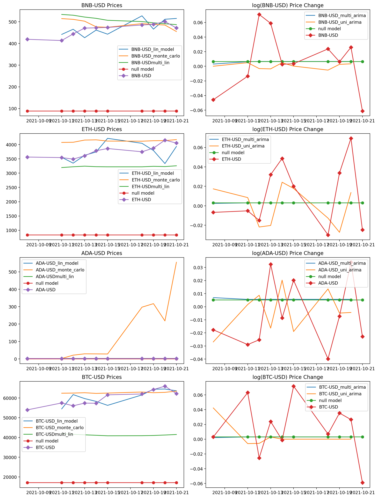

<h1>The Blockchain Guru Project</h1>
    <h3>Introduction</h3>
        
The world of cryptocurrency investing is an exciting one because it is so new. With large surges and dramatic dips in price, crypto can be very intimidating or exciting depending on the person that you are. No matter what a person's investing style is, the ultimate goal is to make profit. With this project, I work to develop a web application that uses machine learning algorithms to predict cryptocurrency prices. This application can help investors make informed trading decisions and reduce unecessary risk. 

    <h3>Repo Structure</h3>
        
For this project, I split my files into two main folders. In the data folder, I store all the price data that the platform uses. I also store the transformed data that the machine learning algorithms use in this folder. In the code folder, I store the code in a way that follows the steps taken for this project so that other people can follow my process. 
 
    <h3>Sources</h3>
        
For this project, I collected data from the Yahoo Finace Platform.

    <h3>The Data</h3>
        
I collected the price history of four different cryptocurrencies (Bitcoin, Ethereum, BinanceCoin, and Cardano) and various stocks (NVDA, AMD,SNP,NAS, and DOW) from the Wall Street Journal, NASDAQ, Yahoo Finance, and the Coindesk website. I chose these four cryptocurrencies  because they had the largest market capitalization and a history longer than two years. For the stocks that I picked, DOW, NAS, AND SNP are stocks that are often used to gauge that status of the American economy so I felt that they could help show a relationship between the American economy and cryptocurrencies. I chose NVDA and AMD because they are popular producers of cryptocurrency mining equipment. I acquired all of my data for both categories by just downloading it from its source. My thought process behind collecting my data was to get any piece of data I felt would be related to predicting the price of ethereum. Because cryptocurrencies are unregulated, it's harder to explain price fluctuations, so by getting a wide variety of data, I have a better chance of finding independent variables with predictive power. There is a clear American bias in the data collected for this project which is important to acknowledge because cryptocurrencies aren’t regulated so people from all over the world can use them. In future iterations of this project, data from more countries would be used to help predict future prices.

    <h3>Modeling</h3>
        
For this project, I developed 5 models. I developed an ARIMA and a Vector Autoregression model to predict price changes. I developed 2 linear models and a Monte Carlo simulation to predict future prices. I used the Akaike Information Criterion as my success metric to compare my models.

        <h2>Model Performance</h2>
            <table style="width:100%;border:1px solid black;">
                <tr >
                    <th>Model</th>
                    <th>A.I.C.</th>
                </tr>
                <tr>
                    <td>ARIMA</td>
                    <td>-2400.55</td>
                </tr>
                <tr>
                    <td>Vector Autoregression</td>
                    <td>-67.27</td>
                </tr>
                <tr>
                    <td>Linear Model 1</td>
                    <td>55.56</td>
                </tr>
                <tr>
                    <td>Linear Model 2</td>
                    <td>133.87</td>
                </tr>
                <tr>
                    <td>Monte Carlo</td>
                    <td>130.59</td>
                </tr>
            </table>
            
    <h3>Conclusions</h3>
        
Overall,the models do a pretty good job of predicting crypto prices considering that this is only the first itereation of this project. There is still work that needs to be done before this platforn can be deployed into the real world. In terms of next  steps, I will look into cloud computing so that I can work with more granular data and develop a platform that can also transform data and make predictions faster. I also want to gain more domain knowledge so that I have a better sense of the crypto feild.

